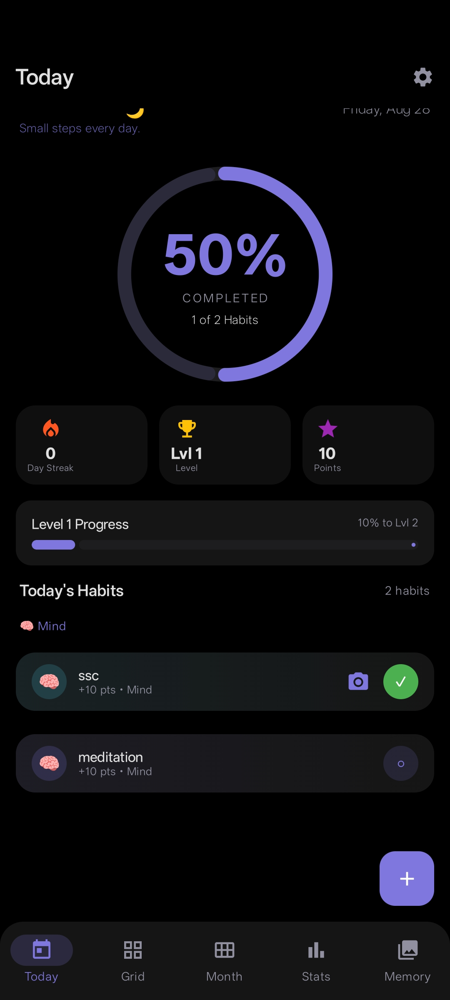
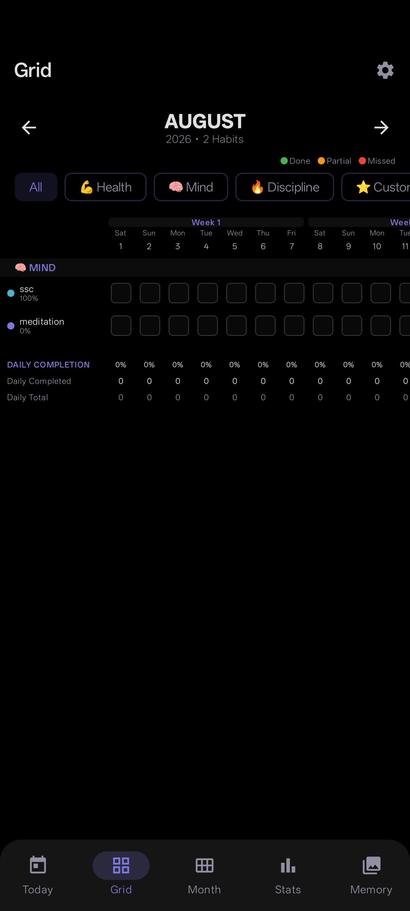
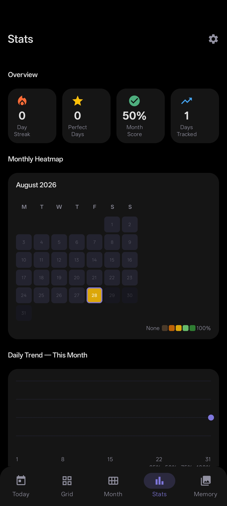
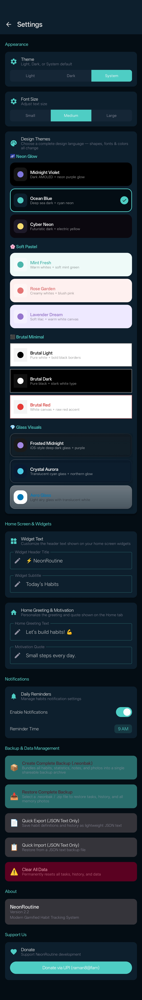
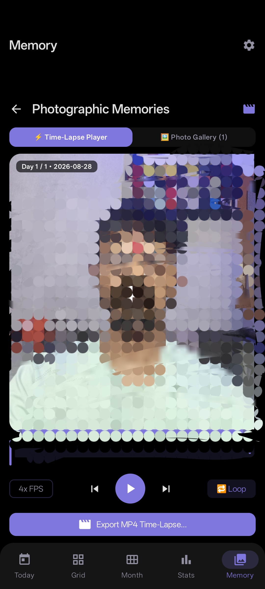

# NeonRoutine ⚡
> Modern, High-Performance 144Hz Habit & Routine Tracker for Android

<p align="center">
  <a href="https://github.com/ramaneon/routine/releases/latest">
    
  </a>
  
  
  
</p>

---

## 📥 Download & Install APK

Directly install the latest production-ready build onto any Android device (Android 8.0+):

👉 **[Download Latest NeonRoutine Release APK](https://github.com/ramaneon/routine/releases/latest/download/NeonRoutine-release.apk)**  
*(Also available under the [Releases](https://github.com/ramaneon/routine/releases) tab)*

---

## 📱 Screenshots & UI Showcase

<p align="center">
  
  
  
</p>

<p align="center">
  
  
</p>

---

## ✨ Key Features

- ⚡ **Zero-Latency 144Hz Navigation**: Instantaneous multi-tab transitions with touch isolation and zero UI-thread stutter.
- 🎯 **Advanced Habit & Task Tracking**: Daily, Weekly, Monthly, and custom interval habits with streak tracking, point scoring, and quick cycle completion.
- 📅 **Interactive Month Heatmap**: Deep historical logging, full month calendar grid, daily completion badges, and past record editing.
- 📊 **Deep Analytics & KPIs**: Real-time completion rates, streak metrics, weekly performance charts, and discipline analytics.
- 📸 **Face Stencil Photographic Memory**: Embedded camera with facial guideline overlay to log consistent daily progress snapshots.
- 🎨 **Adaptive Glassmorphic & Neon Themes**: Switch between **Aero Glass**, **Crystal Aurora**, **Frosted Midnight**, **Neon Glow**, and **Soft Pastel** with auto-adjusting text contrast.
- 📦 **Complete Full-Archive Backup & Restore**: Export all habits, history, notes, and photos into a compressed `.neonbak` archive for seamless device-to-device migration.
- 📴 **100% Offline & Private**: Local-first Room SQLite persistence with zero telemetry or forced cloud dependencies.

---

## 🛠️ Tech Stack & Architecture

- **UI**: 100% [Jetpack Compose](https://developer.android.com/jetpack/compose) + Material 3
- **Database**: [Room Persistence Library](https://developer.android.com/training/data-storage/room) (SQLite)
- **Architecture**: MVVM with Kotlin Coroutines & Reactive `StateFlow` pipelines
- **Widgets**: [Jetpack Glance](https://developer.android.com/jetpack/compose/glance) Launcher Widgets
- **Serialization**: Kotlinx Serialization
- **Image Pipeline**: Coil Image Loader + Local Encrypted App Storage

---

## 🚀 Build from Source

1. Clone repository:
   ```bash
   git clone https://github.com/ramaneon/routine.git
   ```
2. Open in **Android Studio (Ladybug or newer)**.
3. Build & assemble debug/release APK:
   ```bash
   ./gradlew assembleRelease
   ```

---

## 📄 License
MIT License. Created for the modern high-performance Android ecosystem.
