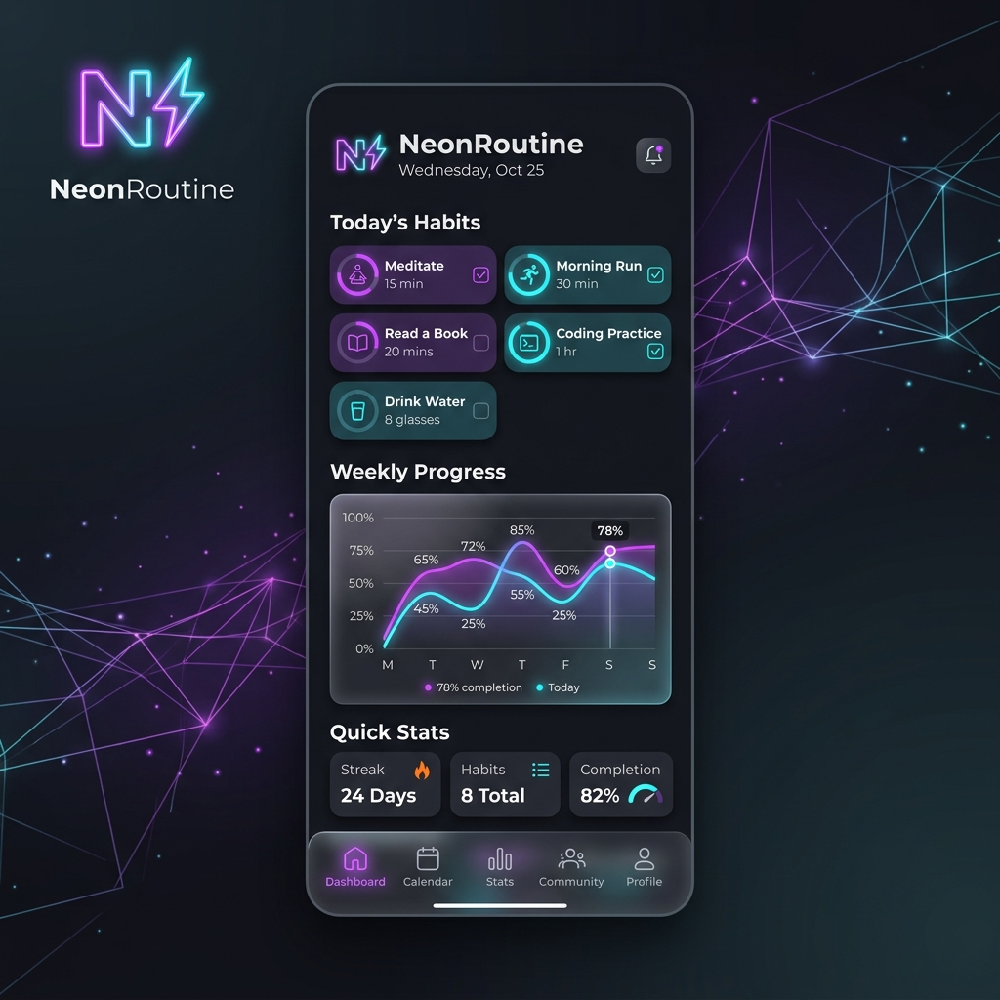

# NeonRoutine ⚡
> Modern, High-Performance Habit Tracking for Android

NeonRoutine is a premium, developer-focused habit tracking application built with **Jetpack Compose** and **Material 3**. It's designed for users who want a high-fidelity, data-driven tool to monitor their daily habits, sleep patterns, and photographic memory progress.

## ✨ Key Features

- **Advanced Habit Tracking**: Flexible recurrence rules including Daily, Weekly, Monthly, and custom **Intervals** (e.g., Every 3 days).
- **Interactive Home Screen Widgets**: 4+ variations of Glance-powered widgets (Weekly Grid, Progress, Streak, Routine) that allow for real-time interaction directly from the launcher.
- **Data-Driven Analytics**: Visualize trends with sleek, custom-built charts (Vico Charts) and heatmaps for monthly completion.
- **Sleep & Recovery System**: Log multiple sleep sessions, track consistency across 7-day windows, and monitor recovery metrics.
- **Face Memory Time-Lapse**: Integrated camera feature with a facial stencil overlay to ensure consistent photographic memory logging.
- **Dynamic Theming Engine**: Switch between multiple design systems including **Neon Glow**, **Soft Pastel**, and **Brutal Minimal**.
- **Local-First Reliability**: Powered by a robust **Room DB** architecture for offline-first performance with optional cloud sync capabilities.
- **Built-in Pomodoro Timers**: Integrated focus sessions for high-discipline tasks.

## 🛠️ Tech Stack

- **UI Framework**: [Jetpack Compose](https://developer.android.com/jetpack/compose) (100% Kotlin)
- **Database**: [Room Persistence Library](https://developer.android.com/training/data-storage/room)
- **Architecture**: MVVM (Model-View-ViewModel) with clean data layering
- **Background Tasks**: [WorkManager](https://developer.android.com/topic/libraries/architecture/workmanager) for notification scheduling
- **App Widgets**: [Jetpack Glance](https://developer.android.com/jetpack/compose/glance)
- **Networking/Serialization**: [Kotlinx Serialization](https://kotlinlang.org/docs/serialization.html)
- **Image Loading**: [Coil](https://coil-kt.github.io/coil/)
- **Visuals/Charts**: [Vico](https://github.com/patrykandpatrick/vico)

## 🏗️ Architecture

The project follows the current Android best practices with a clean, decoupled architecture:

- **`data`**: Houses the Room database, entity models, and repository layer.
- **`ui`**: contains the Compose-based design system, reusable components, and screen-level implementations.
- **`viewmodel`**: Reactive state management using Kotlin Flows to ensure the UI stays in sync with the database at all times.
- **`notifications`**: Robust alarm scheduling engine for recurring reminders and daily summaries.
- **`widget`**: Interactive Glance components synchronized with the primary app state.

## 🚀 Getting Started

1. Clone the repository: `git clone https://github.com/yourusername/neonroutine.git`
2. Open in **Android Studio (Ladybug or newer)**.
3. Sync Project with Gradle Files.
4. Run on an Android device (API 26+).

## 📄 License
MIT License. Created by [Your Name] for the modern Android ecosystem.
